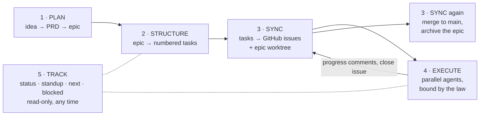
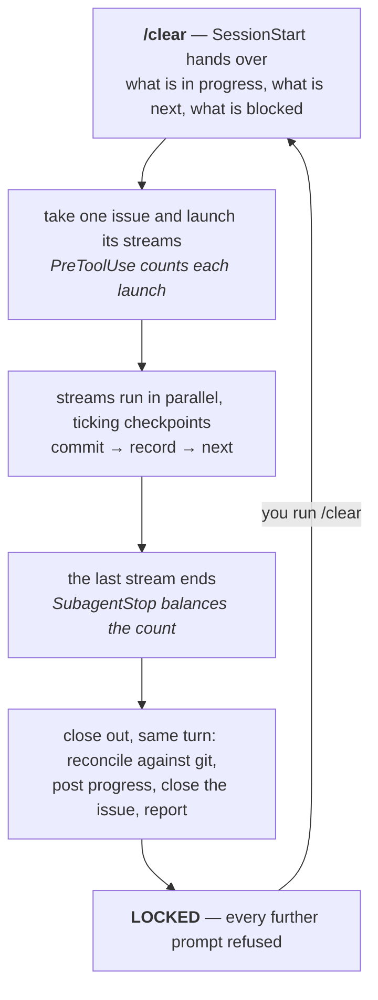
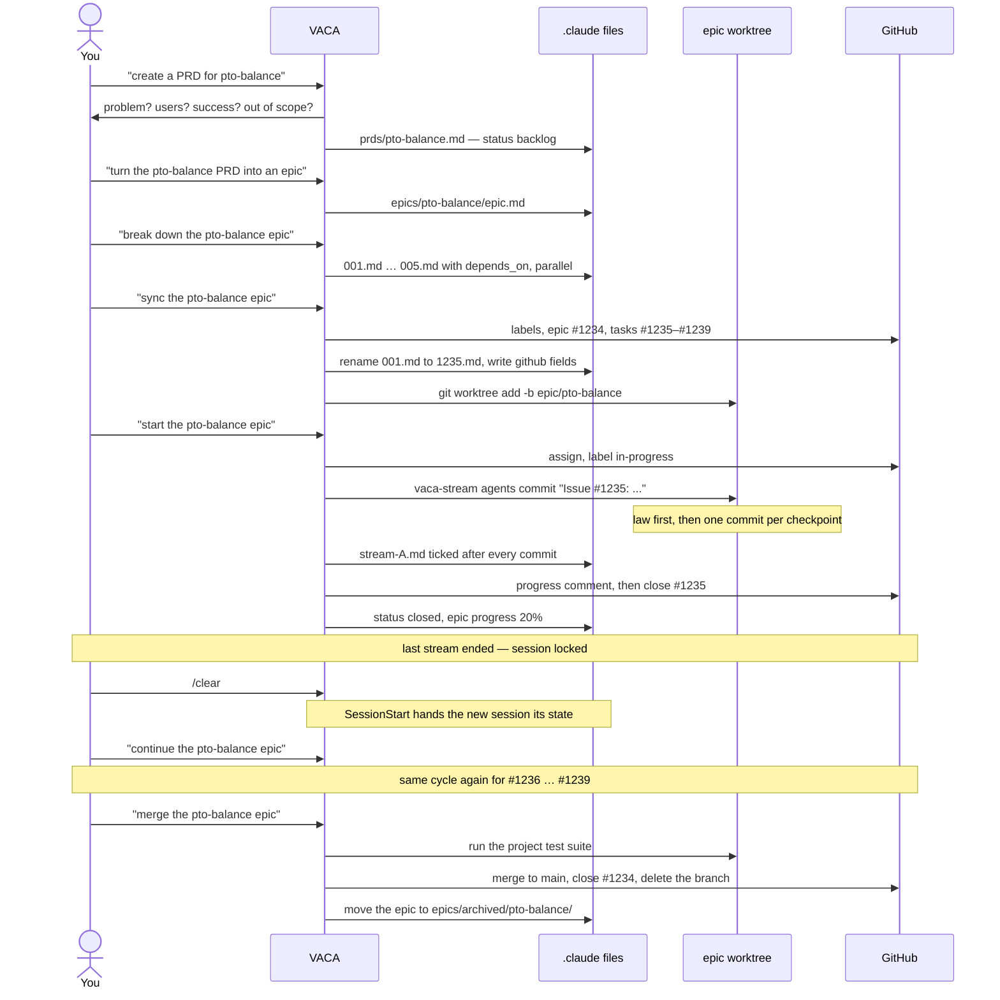
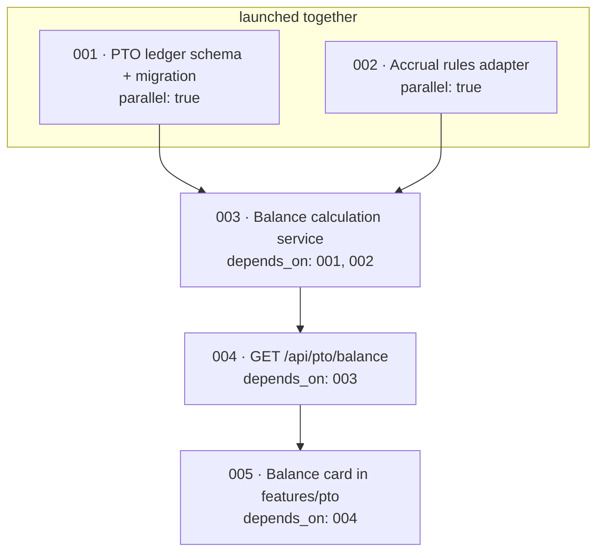

# vensure-marketplace

A Claude Code plugin marketplace: engineering governance and delivery tooling
for .NET and React services.

## Requirements

The `law` skill needs nothing beyond Claude Code. `vaca` drives git and GitHub,
so it needs:

| | | |
|---|---|---|
| **git** | required | Epics run in a worktree per epic. |
| **[GitHub CLI](https://cli.github.com/)** (`gh`) | required | Creates and updates issues. Must be authenticated: `gh auth login`. |
| **`bash` and `awk`** | required | The tracking scripts and the session hooks. Present on macOS and Linux; on Windows use Git Bash, which ships with Git. |
| **[`gh-sub-issue`](https://github.com/yahsan2/gh-sub-issue)** | optional | Links tasks to their epic as GitHub sub-issues. Without it, tasks are created as plain issues. Install: `gh extension install yahsan2/gh-sub-issue` |

There is no setup step. VACA creates `.claude/prds/` and `.claude/epics/` in your
project as it needs them, starting with your first PRD.

Issue labels (`epic`, `task`, `feature`, `bug`, and one `epic:<name>` per epic)
are created on your GitHub repository the first time an epic syncs, so the
account running `gh` needs permission to create labels there.

## Install

```bash
/plugin marketplace add josefernandez-vensure/vensure-marketplace
```

```bash
/plugin install rancho@vensure-marketplace
```

Then run `/reload-plugins` if the install summary asks you to.

## Plugins

### rancho — Dev Assistant

Two skills, one command, and one agent, installed together. The skills are usable independently.

| | Invoke | What it does |
|---|---|---|
| skill `law` | `/rancho:law` | The engineering law: module boundaries, API and error contracts, validation placement, data classification and egress, AI-agent permissions, observability. Backend (.NET/DDD), frontend (React), and the enforcement inventory load on demand. |
| skill `vaca` | `/rancho:vaca` | Vensure Agentic Code Assistant. Spec-driven delivery: PRD → epic → GitHub issues → parallel agents → shipped code. |
| command | `/rancho:help` | The VACA reference card: the five phases, the phrases that drive each, and where VACA keeps its state. |

The two are meant to work together. VACA decides *what* gets built and in what
order; the law decides what the finished code must look like. Agents that VACA
launches read the law before writing anything.

A `SessionStart` hook states that the law is binding and points at the skill. It
deliberately restates no rules, so there is exactly one copy of each to keep
current.

Three further hooks hold a VACA session to a single issue: two count work
streams as they launch and finish, and a third refuses further prompts once
those counts balance. The rule is [One session, one issue](#one-session-one-issue);
the wiring is in [the plugin's own README](plugins/rancho/README.md).

`vaca` is driven in natural language — "create a PRD for X", "what's next",
"standup", "start working on issue 42". The two sections below are the whole of
it: the reference card, then one feature from ideation to archive.
`/rancho:help` prints the same card inside a session.

## Using VACA

The five phases have no slash commands — VACA is driven in plain language, and
the phrases below are examples rather than syntax. `/rancho:help` prints the
same card inside a session, straight from
`plugins/rancho/skills/vaca/scripts/help.sh`. That script is the source of
truth if this section ever drifts from it.



Sync sits on both sides of Execute: before, because the issue numbers and the
worktree come from it, and after, because progress, closures, and the merge all
go back to GitHub.

| Phase | Say something like | What happens |
|---|---|---|
| **1 · Plan** | "create a PRD for &lt;feature&gt;" | A real brainstorm — problem, users, success, out of scope — then `.claude/prds/<feature>.md` |
| | "turn the &lt;feature&gt; PRD into an epic" | Architecture decisions and a task preview in `.claude/epics/<feature>/epic.md`, aiming at ≤10 tasks |
| | "edit the &lt;feature&gt; PRD" | Targeted edit; frontmatter preserved |
| **2 · Structure** | "break down the &lt;feature&gt; epic" | Numbered task files `001.md`, `002.md`… each carrying `depends_on`, `parallel`, and `conflicts_with` |
| **3 · Sync** | "sync the &lt;feature&gt; epic" | Labels, epic issue, task issues, task files renamed to their issue numbers, worktree created |
| | "sync issue &lt;N&gt;" | Local progress posted to the issue as a comment |
| | "close issue &lt;N&gt;" | Issue closed, ticked off in the epic issue, epic progress recalculated |
| | "found a bug in issue &lt;N&gt;" | A linked bug issue carrying the original's context |
| | "merge the &lt;feature&gt; epic" | Tests, merge to main, branch and worktree removed, epic archived |
| **4 · Execute** | "analyze issue &lt;N&gt;" | Independent work streams and their file scopes, written to `<N>-analysis.md` |
| | "start working on issue &lt;N&gt;" | One `vaca-stream` agent per stream, in the epic worktree |
| | "start the &lt;feature&gt; epic" | Takes the next ready issue and runs it — one issue, not the whole epic |
| | "continue the &lt;feature&gt; epic" | The same, after a `/clear`: reconciles whatever was left in flight, then takes the next issue |
| **5 · Track** | "project status", "standup", "what is next", "what is blocked", "what is in progress", "list epics", "show the &lt;feature&gt; epic", "list PRDs", "PRD status", "search for &lt;query&gt;", "validate" | Read-only reports |

### One session, one issue

A session takes one issue, runs its streams in parallel, closes it out, and
ends. It does not go on to the next issue — and that is enforced rather than
suggested. Hooks count every stream that launches and every stream that
finishes; when the counts balance, the session locks and refuses further
prompts until you run `/clear`.



The lock arms *after* the last stream ends, so the close-out — reconciling the
stream files against git, posting the progress comment, closing the issue —
still happens in the session that has the context for it. Only your next
message is refused.

Clearing costs nothing because VACA never kept anything in the conversation.
A `SessionStart` hook hands the new session what is in progress, what is ready,
and what is blocked, read from `.claude/` before you type. Then:

> **You:** "continue the pto-balance epic"

If a lock is ever wrong, resend the message with `VACA OVERRIDE` in it. Prompts
beginning with `/` always pass, so `/clear` can never be swallowed by the gate.

Tracking is scripts, not reasoning: `status.sh`, `standup.sh`, `next.sh`,
`blocked.sh`, `in-progress.sh`, `validate.sh`, `epic-list.sh`, `epic-show.sh`,
`epic-status.sh`, `prd-list.sh`, `prd-status.sh`, `search.sh`, and `help.sh`,
all under `skills/vaca/scripts/`. Frontmatter is parsed in exactly one place —
the `awk` readers in `scripts/lib/` — so every report agrees with every other
one, and stays fast as the project grows.

All state is files, under the project root:

```
.claude/
├── prds/<feature>.md                  product requirements
└── epics/
    ├── <feature>/
    │   ├── epic.md                    technical epic
    │   ├── <N>.md                     task, named for its GitHub issue
    │   ├── <N>-analysis.md            parallel work streams for one issue
    │   ├── github-mapping.md          issue number → URL
    │   ├── execution-status.md        active agents
    │   └── updates/<N>/
    │       ├── stream-A.md            one per agent: checkpoints, commits
    │       └── progress.md            the issue's rolled-up state
    └── archived/<feature>/            completed epics
```

Nothing needs creating up front. Each phase makes the directories it needs.

## A feature, end to end

One feature — `pto-balance` — from a sentence in chat to an archived epic.
Issue numbers are invented; everything else is what VACA actually does.



### 1 · Ideation

> **You:** "I want employees to see their PTO balance before they request time off"

VACA does not start writing. It runs a brainstorm first — what problem this
solves, who is affected, what success looks like, what is explicitly out of
scope, and what constrains it. Only then does it write
`.claude/prds/pto-balance.md`, with `status: backlog` and sections through to
*Out of Scope* and *Dependencies*. A PRD with placeholder text, unmeasurable
success criteria, or user stories missing acceptance criteria does not get
saved — those are the quality gates on the phase.

### 2 · PRD → epic

> **You:** "turn the pto-balance PRD into an epic"

`.claude/epics/pto-balance/epic.md` — architecture decisions, technical
approach split across frontend, backend, and infrastructure, and a task
breakdown preview. Two constraints shape it: aim for ten tasks or fewer, and
look for existing functionality to lean on before adding new code.

### 3 · Epic → tasks

> **You:** "break down the pto-balance epic"

Five task files, `001.md` through `005.md`, each with acceptance criteria, an
effort estimate, and the dependency metadata that decides what can run at once:



`depends_on` is what must finish first, `parallel` is whether the task may run
alongside others, and `conflicts_with` names the tasks touching the same files.
Circular dependencies are an error, and are caught here.

### 4 · Sync to GitHub

> **You:** "sync the pto-balance epic"

This is the first write to GitHub, so it starts with the repository safety
check — resolve `origin`, derive `owner/repo`, and stop on any `gh` failure
rather than leaving the local files and the remote issues disagreeing. Then:

- Labels created, idempotently: `epic`, `task`, `feature`, `bug`, and
  `epic:pto-balance`. A missing label is a hard failure on `gh issue create`,
  which is why they come first.
- Epic issue **#1234**, then task issues **#1235–#1239** — sub-issues of the
  epic if [`gh-sub-issue`](https://github.com/yahsan2/gh-sub-issue) is
  installed, plain issues if not.
- `001.md` becomes `1235.md`, and every `depends_on` and `conflicts_with` entry
  is rewritten from sequential numbers to real issue numbers.
- `github:` and `updated:` set on the epic and on every task.
- A worktree: `git worktree add ../epic-pto-balance -b epic/pto-balance`, cut
  from an up-to-date `main`.
- `github-mapping.md`, so issue numbers and URLs stay resolvable offline.

### 5 · Execute — one issue

> **You:** "start the pto-balance epic"

VACA reads every task, sorts them into ready, blocked, in progress, and
complete, and takes **one**: the first ready issue, #1235. The others it names,
so you can see the queue, and leaves alone. It analyses that issue for
independent work streams — the file scopes that can be written simultaneously
without collision — writes `1235-analysis.md`, and launches one `vaca-stream`
agent per stream, all inside `../epic-pto-balance/`, never in your own checkout.

Each agent writes its checkpoint list before its first line of code — the
smallest independently committable pieces of its scope — then works the loop:
do the piece, commit it as `Issue #1235: <change>`, immediately record it in
`updates/1235/stream-A.md`, and only then start the next one.

```markdown
- [x] 1. PTO ledger entity and configuration — a1b2c3d — 2026-09-11T14:22:05Z
- [x] 2. EF migration — 9f4e2b1 — 2026-09-11T14:51:38Z
- [ ] 3. Backfill for balances already accrued
```

Never more than one checkpoint between the file and reality. The frontmatter's
`last_commit` names the newest commit the file accounts for, which is what lets
a later session check the claim against `git log` rather than believe it. The
law comes first for every agent, and where a task cannot be built without
breaking it the task is the defect — the agent stops and says so rather than
shipping the violation.

Meanwhile, from your own checkout:

> **You:** "what is in progress" · "sync issue 1235" · "standup"

### 6 · Close out, then clear

When the last stream ends the session locks — and VACA closes the issue out in
that same turn, because it is the last turn it gets. It reconciles each stream
file against `git log` (a file behind its commits means an agent died between
committing and recording, and the log wins), rolls `progress.md` and
`execution.md` forward, posts the progress comment, and closes #1235 if its
acceptance criteria are met — ticking its box in epic #1234 and recalculating
the epic's `progress:`. Then it stops:

```
✅ Issue #1235 complete — PTO ledger schema and migration
   Streams:  A ✓   B ✓
   Commits:  7 on epic/pto-balance
   Issue:    closed

This session is finished. Run /clear, then say:
  "continue the pto-balance epic"
```

Anything you type instead is refused and erased, with those same instructions.

> **You:** `/clear`, then "continue the pto-balance epic"

The new session is handed the state before it reads your message, reconciles
anything left in flight, and takes #1236. Five issues, five sessions.

### 7 · Bugs found in testing

> **You:** "found a bug in issue 1238 — the balance ignores carry-over"

A bug task is written into the same epic carrying the original issue's context,
then filed as its own issue opening with `follow-up to #1238`, so GitHub links
the two. It is an ordinary task from then on, and gets its own session:
"start working on issue &lt;N&gt;".

### 8 · Merge and clean up

> **You:** "merge the pto-balance epic"

Blocked if the worktree is dirty, and warned if task issues are still open.
Otherwise the project's test suite runs in the worktree first, and only then:

```bash
git checkout main && git pull origin main
git merge epic/pto-balance --no-ff -m "Merge epic: pto-balance"
git push origin main
git worktree remove ../epic-pto-balance
git branch -d epic/pto-balance
git push origin --delete epic/pto-balance
```

The epic directory moves to `.claude/epics/archived/pto-balance/`, its
frontmatter flips to `status: completed`, and epic issue #1234 is closed with a
comment. What is left is a merged feature, a closed epic with every task issue
linked beneath it, and the whole paper trail — PRD, epic, tasks, per-agent
progress — still in the repository under `archived/`:

```
.claude/
├── prds/pto-balance.md                    the requirements, left in place
└── epics/archived/pto-balance/
    ├── epic.md                            status: completed, progress: 100%
    ├── 1235.md … 1239.md                  status: closed
    ├── github-mapping.md
    └── updates/                           what each agent did, and when
```

If anything looks inconsistent along the way — an orphaned task file, a missing
`github:` link, a dependency pointing at nothing — "validate" reports it
without changing anything.

## Layout

```
vensure-marketplace/
├── .claude-plugin/
│   └── marketplace.json      the catalog — one entry per plugin
├── plugins/
│   └── rancho/
│       ├── .claude-plugin/plugin.json
│       ├── skills/law/       SKILL.md + references/
│       ├── skills/vaca/      SKILL.md + references/ + scripts/
│       ├── commands/help.md  the /rancho:help command
│       ├── hooks/hooks.json  SessionStart: the prime directive
│       ├── output-styles/
│       └── ...               agents/, workflows/, monitors/, themes/, bin/
│                             are scaffolded but empty
└── README.md
```

Plugins are independent. Each is installed and enabled on its own, owns its own
version, and shares nothing with its neighbours at runtime — the marketplace is
a catalog, not a container.

## Adding a plugin

1. Create `plugins/<name>/` with a `.claude-plugin/plugin.json` manifest.
2. Add an entry to `.claude-plugin/marketplace.json`:

   ```json
   {
     "name": "<name>",
     "source": "./plugins/<name>",
     "description": "One line on what it does",
     "version": "1.0.0",
     "author": { "name": "Vensure Engineering" }
   }
   ```

   `source` paths resolve relative to this repository root and must start with
   `./`. Never use `../` — anything outside the marketplace root is rejected.

3. Validate both levels, then commit:

   ```bash
   claude plugin validate ./plugins/<name>
   ```

`metadata.pluginRoot` is set to `./plugins`, so entries may instead use a bare
`"source": "<name>"`. That form needs Claude Code v2.1.239 or later; the
explicit `./plugins/<name>` path works on every version, which is why the
entries here spell it out.

## Renaming or removing a plugin

Users have the old name pinned in their settings, so record the change in the
`renames` map in `marketplace.json` — former name to current name, or `null` if
the plugin is gone:

```json
"renames": { "old-name": "new-name", "retired-plugin": null }
```

Skipping this leaves installed copies orphaned rather than migrated.

## Versioning

A plugin's `version` pins it: users receive an update only when that string
changes. Bump it in **both** `plugins/<name>/.claude-plugin/plugin.json` and the
marketplace entry, or installs will disagree about what is current.

## Local development

Test a plugin without installing it:

```bash
claude --plugin-dir ./plugins/rancho
```

`/reload-plugins` picks up edits without a restart. A `--plugin-dir` plugin
shadows an installed one of the same name for that session, so you can iterate
on a plugin you already have installed.

Shell scripts and awk programs are forced to LF by `.gitattributes`. Keep it
that way — a CRLF shebang fails on Linux and macOS with `bad interpreter`, and
this repo is cloned onto machines that are not Windows.

## Licence

MIT — see [LICENSE](LICENSE).

The `vaca` skill is derived from [CCPM](https://github.com/automazeio/ccpm)
by Ran Aroussi, also MIT. That attribution and the original notice are in
[NOTICE](NOTICE), as the licence requires.

Issues and pull requests welcome.
